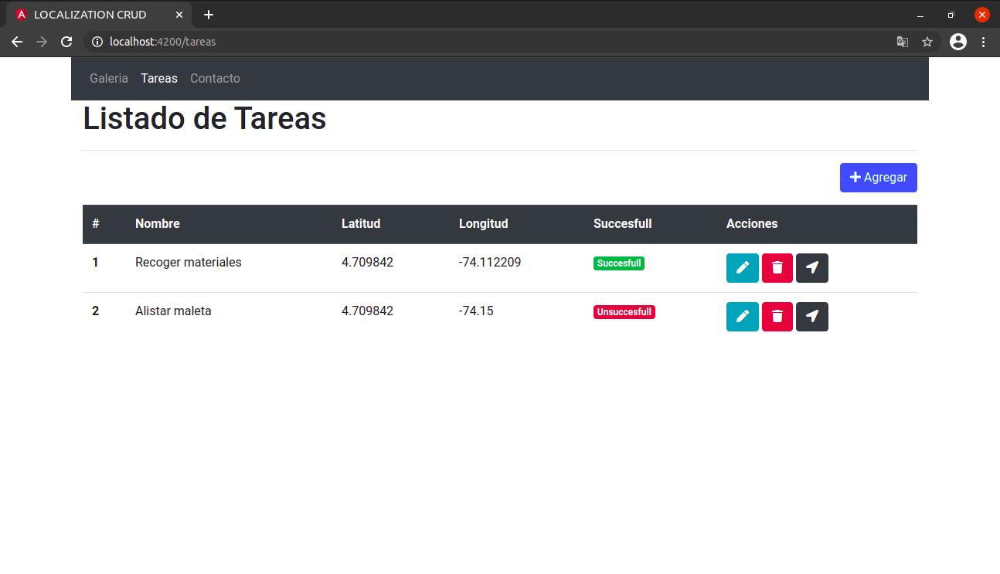
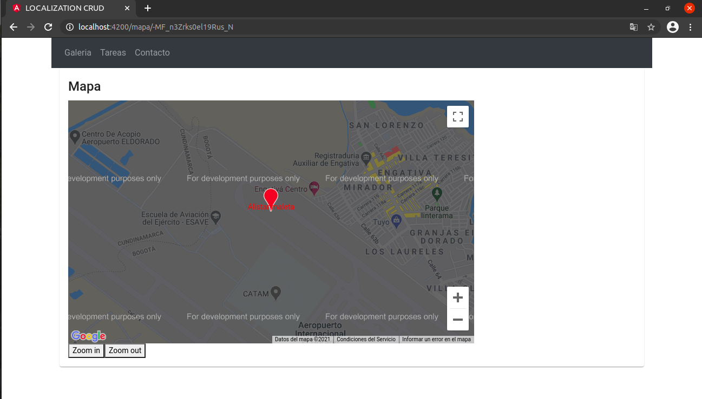

# Location CRUD

Web app developed in Angular. Contain CRUD of task that include localization for coordinates. 

## Tareas Page

In this page you can see all task that you create. Add your database.

## Mapa Page

In this page you can see the location for the coordinates that you add in your task create. Add your API Google maps key.

Enjoy!

